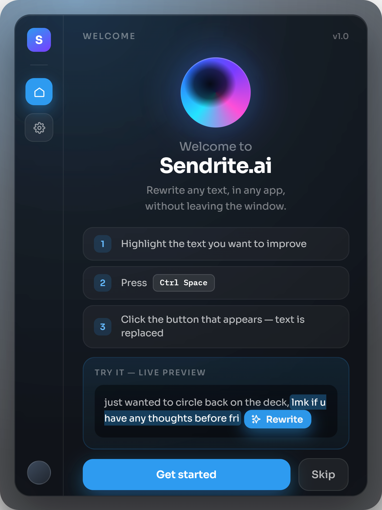

# Sendrite

**Rewrite any text, in any app, without leaving the window.**

Highlight text anywhere — Slack, a LinkedIn post, your notes app — press a hotkey, and a
small floating button appears next to it. Click it and the highlighted text is replaced
in place with an AI-improved version, powered by Claude.




---

## How it works

1. Highlight text in any application
2. Press `Ctrl+Alt+Space` (`⌘⌥Space` on macOS) — a small pill appears next to your selection, without stealing focus from the app you're in
3. Click **Rewrite** (or pick a style — shorten, formal, casual, fix grammar) and the text is replaced in place

Under the hood: a global hotkey triggers a clipboard-based selection capture, a
speculative Claude call starts firing before you even click, and the result is pasted
back over your original selection. The whole round trip is typically under 1.5 seconds.

For the full technical breakdown — process architecture, security model, and why each
design decision was made — see **[ARCHITECTURE.md](ARCHITECTURE.md)**.

## Features

- **Works everywhere** — any app that supports standard copy/paste, no per-app integration needed
- **Never steals focus** — the button overlay is non-activating, so your source app stays in the foreground the whole time
- **Five rewrite styles** — Improve, Shorten, Formal, Casual, Fix grammar
- **Fast by default** — Claude Haiku 4.5 out of the box, with Sonnet 5 / Opus 5 available for higher-quality rewrites
- **Predictive prefetch** — the rewrite starts while you're still reaching for the button, so it's usually ready by the time you click
- **Your key, your data** — bring your own Anthropic API key, encrypted at rest with your OS keychain (DPAPI on Windows, Keychain on macOS). It never leaves your machine, and the app has no way to read it back out once saved
- **Configurable hotkey, instant mode, and model choice** — all from a native settings window

## Getting started

### Prerequisites

- Node.js 20+
- An [Anthropic API key](https://console.anthropic.com/settings/keys)

### Install and run

```bash
git clone https://github.com/MHamzaFarooq/sendrite.ai.git
cd sendrite.ai
npm install
node scripts/make-icons.mjs   # generates tray + installer icons from the logo, run once
npm run dev
```

The app lives in the system tray (menu bar on macOS) and opens its window on every
launch -- the welcome flow on first run, Settings after that.

1. Paste your Anthropic API key into **Settings → Use my own Claude API key** and hit **Test**
2. Highlight text in any app
3. Press `Ctrl+Alt+Space` (`⌘⌥Space` on macOS)

#### macOS only

macOS gates synthetic keystrokes behind Accessibility permission. Settings will detect
this and link you straight to the right pane in System Settings. Grant it to **Sendrite**
(or to your terminal / Electron binary while developing), then restart the app. Windows
needs no equivalent permission.

## Configuration

| Setting | Default | Notes |
|---|---|---|
| Hotkey | `Ctrl+Alt+Space` | `Ctrl+Space` is deliberately blocked — it collides with IME switching and IDE autocomplete |
| Model | Claude Haiku 4.5 | Sonnet 5 and Opus 5 selectable; Haiku is the default because this interaction lives or dies on latency |
| Instant mode | Off | Skip the button and rewrite immediately on hotkey press |
| Predictive prefetch | On | Start the rewrite while you're still reaching for the button |

## Building

| Command | What it does |
|---|---|
| `npm run dev` | Run with hot reload |
| `npm run smoke` | Regenerate icons and verify the native keyboard bridge |
| `npm run typecheck` | Type-check main, preload, and renderer |
| `npm run build` | Type-check, then bundle to `out/` |
| `npm run pack:win` | Build a Windows NSIS installer into `release/` |
| `npm run pack:mac` | Build a macOS DMG into `release/` |

## Troubleshooting

**`TypeError: Cannot read properties of undefined (reading 'isPackaged')`**

VS Code's integrated terminal exports `ELECTRON_RUN_AS_NODE=1`, which makes Electron boot
as a plain Node process, so `require('electron')` returns a path string instead of the
API. `npm run dev` and `npm run start` go through [`scripts/run.mjs`](scripts/run.mjs),
which strips the variable. If you invoke `electron-vite` directly, unset it first.

**Nothing happens when I press the hotkey**

Run `npm run smoke` to check the native bridge resolves. If the hotkey itself is taken by
another app, Sendrite shows a dialog at startup and opens Settings — pick another combo.

## Project status

Sendrite is in **private beta**. The core rewrite flow — hotkey, selection capture,
Claude call, paste-back — works end to end on both Windows and macOS.

**Known limitations (v1):**
- Selection capture is clipboard-based, which works in essentially every app but anchors
  the button to your mouse cursor rather than to the text itself. A v2 accessibility
  sidecar (UI Automation on Windows, `AXUIElement` on macOS) is planned to fix this — see
  the interface in [`src/main/selection/index.ts`](src/main/selection/index.ts).
- The clipboard round-trip preserves text only; an image on the clipboard during a
  rewrite is lost.
- A shared-key "Pro" tier (no setup, subscription-based) is planned but not yet built —
  the option is visible in Settings, marked **Coming soon**. Only the bring-your-own-key
  path is functional today.

## Security

- Renderer processes run with `contextIsolation: true` and `nodeIntegration: false`;
  everything crosses process boundaries through an explicit preload allowlist
- Your API key is encrypted at rest via Electron's `safeStorage` and is never exposed to
  any renderer process
- No telemetry, no analytics, no data leaves your machine except the selected text sent
  directly to Anthropic's API for the rewrite itself

## License

Proprietary. All rights reserved.
